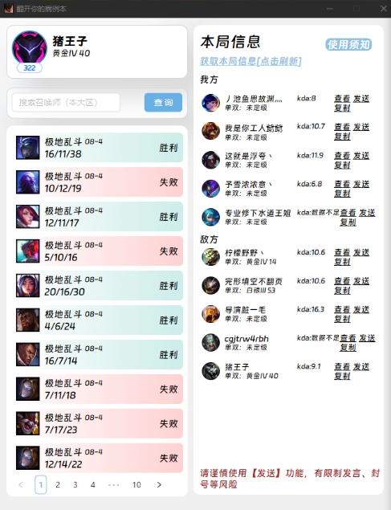
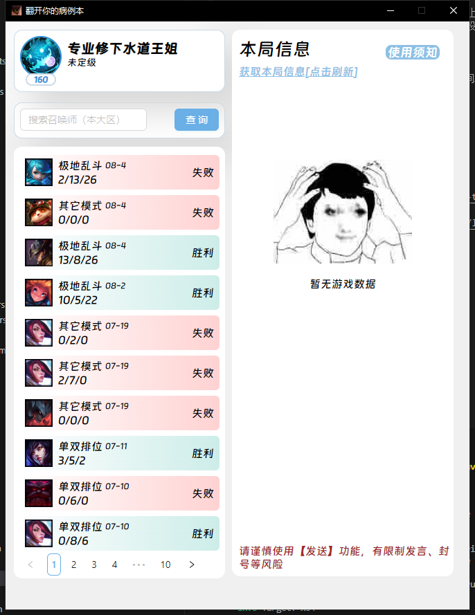

# Tauri + React + Typescript + Rust

可以查询隐藏战绩，合法正规不封号

lcu提供的api很多，能做的好玩的东西也很多，很多线上提供的游戏辅助工具都是基于这个开发的。
最近写的代码很少，rust也是边做边看文档，很多东西没写好，和预期功能也有一定差距。
之后有时间再迭代【下次一定】

调用的第三方接口并不是我在维护，某些大区在某些时间段可能会挂掉查不到战绩（可以试试用其他工具也是查不到的），可以换时间试试

### -----------------更新
新增了查询当前游戏
适合排位\匹配查队友对面战绩

有禁言风险
自求多福

### 参考文档
https://hextechdocs.dev/getting-started-with-the-riot-games-api/

https://riot-api-libraries.readthedocs.io/en/latest/lcu.html#lcu-explorer

https://lcu.vivide.re/

### 参考源码
@Java_S 

有问题联系 tuziqwq@gmail.com (..＞◡＜..)

